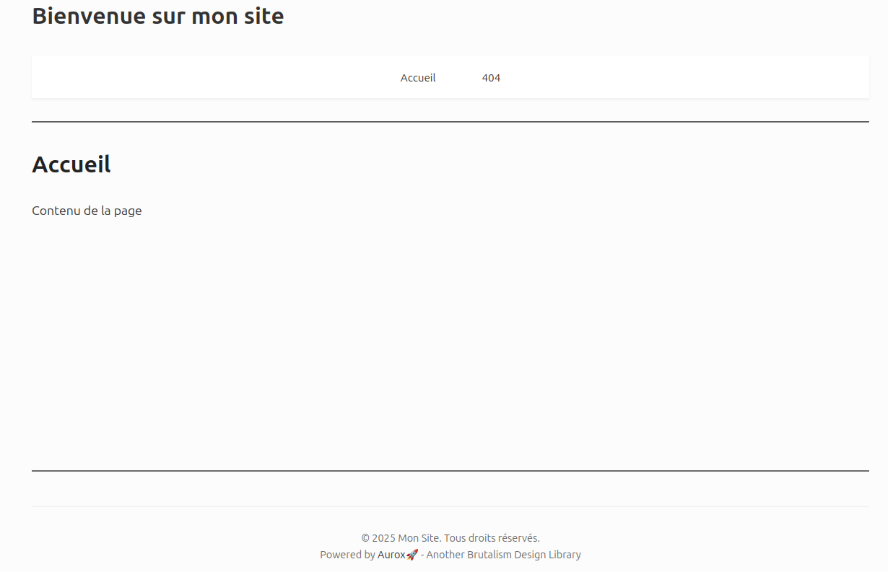

# Aurox

**Une collection d’utilitaires PHP inspirée du Brutalisme et du Brutalism Dev Design.**

---

⚠️ **ALPHA - Ne pas utiliser en production**  
Le projet est en cours de développement, tout peut encore changer. À vos risques et périls. 😉

**Licence : MIT**  
**Prérequis : Apache2 + PHP ≥ 8.1**

---

## À propos

Aurox peut s’utiliser de deux façons :

- comme **librairie utilitaire via Composer**
- comme **moteur d’application web minimaliste**

Ce dépôt contient un **kit de démarrage** dans [`/public`](public) avec un exemple fonctionnel.

> Aurox n’est pas un framework.  
> C’est un moteur simple, brut, avec des outils basiques pour démarrer vite.

Le code est en **phase de R&D**. Beaucoup de composants sont encore au stade de prototype :  
tests, benchmarks, sécurité et documentation sont à venir.



---

## Utilisation comme librairie

Aurox peut être intégrée à vos projets via Composer :

```bash
composer require osd84/aurox
````

Puis, dans votre projet :

```php
require_once __DIR__ . '/vendor/autoload.php';
```

Toutes les classes et fonctions sont accessibles, selon les exemples fournis ici.

---

## Utilisation comme squelette d’application

Vous pouvez aussi utiliser Aurox comme point de départ pour une application web.

1. Téléchargez la dernière release :
   👉 [https://github.com/PetitCitron/aurox/releases/latest](https://github.com/PetitCitron/aurox/releases/latest)

2. Décompressez-la à la racine de votre projet web.

3. Installez les dépendances :

```bash
composer install
composer dump-autoload
```

4. Copiez le fichier `conf_example.php` en `conf.php` et adaptez-le à votre projet.

5. Configurez Apache pour exposer uniquement le dossier `/public` :

```apache
DocumentRoot /var/www/mon_projet/public/
```

---

## Structure de base

* Vos **routes** vont dans [`app/AppUrls.php`](app/AppUrls.php)
* Vos **modèles**, si besoin, dans [`app/Models`](app/Models)
* Incluez [`aurox.php`](aurox.php) dans vos fichiers `.php` comme dans [`public/index.php`](public/index.php)
* Créez vos propres templates, contrôleurs, etc.

> Aurox ne fournit **ni système de routing**, **ni sécurité intégrée**.
> C’est à vous de gérer. C’est volontaire.

---

## Sécurité & Limitations

* [`BaseModel.php`](src/OsdAurox/BaseModel.php) **n’est pas un ORM**
* Les arguments `$field` sont vulnérables aux injections SQL. **N’y passez jamais de variables.**
* Le reste utilise PDO et est normalement sécurisé.

---

## Note 

Ce projet est partagé **tel quel**, dans un esprit de liberté et de curiosité. <br>
Pas de promesse, pas de magie.

---

Documentation : [doc.md](doc.md)

